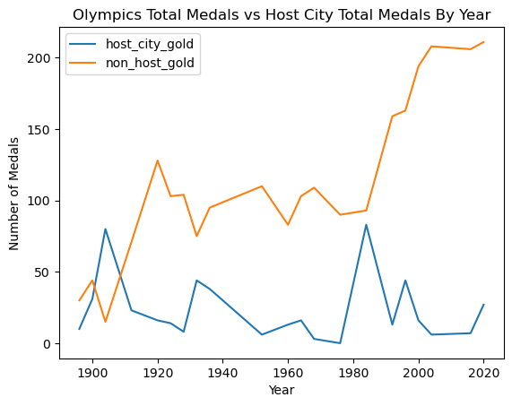
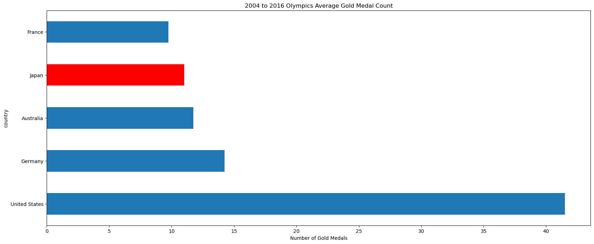
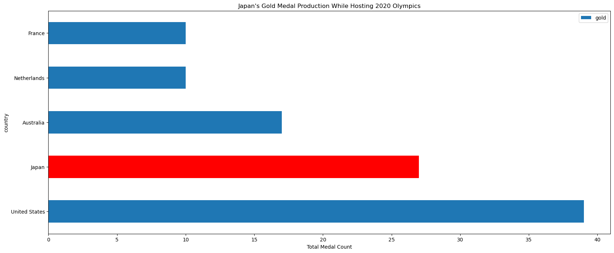

<h1> Historical Olympic Medal Analysis </h1>

## Project Overview 
This project is a comprehensive analysis of global data related to the Olympics, combining datasets on world population, GDP, and Olympic performance (medals). Through this analysis, we aim to uncover trends and correlations that could provide valuable insight for future Olympic Games. 

## Datasets
The analysis is based on five key datasets:    
**world_population.csv**: Contains population data for each country.    
**gdp.csv**: Includes GDP figures for every country.     
**olympic_medals.csv**: Records the medal count for each country in each Olympic event.     
**olympic_analysis.csv**: Details the start and end dates of the Olympics, host country, participating   countries, and the year.      
**Olypmic_Games.csv**: Lists the country, city, and year of the Olympic Games.       

## Installation and Setup
To run this project, you need to have Python installed along with the following libraries:
* pandas
* matplotlib
* numpy
* seaborn
* sklearn

### Installation Steps:
1. Clone the repository to your local machine. 
2. Navigate to the project directory. 
3. Install the required libaries using pip:
* `pip install pandas matplotlib numpy seaborn sklearn`
4. Ensure the CSV files are placed in the `data/` directory. 

## Anlysis Techniques
This project uses the following analytical methods:

## Key Findings

## Conclusion

## Future Work
* A more granular analysis of individual sports and countries that typically dominate a particular sport. 
* Incoporating additional datasets like education levels, or healthcare metrics. 
* Pedictive modeling to forecast future Olympic performances. 
# Licensing & Usage
The project falls under the CC0 1.0 UNIVERSAL, no rights reserved. Feel free to use, modify, distribute, or build upon the work for any purpose, without asking permission or providing attribution to us as creators ⭐️
## References
[Xpert Learning Assistant] - Assisted in debugging and cleaning code.    
[BCS Slack Tutor] - Organization and Planning    

### Datasets
[GDP]    
[Olympic Analysis](https://www.kaggle.com/datasets/muhammadehsan000/olympic-historical-dataset-1896-2020)    
[Olympic Host](https://www.kaggle.com/datasets/muhammadehsan000/olympic-historical-dataset-1896-2020)     
[Olympic Medals](https://www.kaggle.com/datasets/muhammadehsan000/olympic-historical-dataset-1896-2020)    
[Olympic Games](https://www.kaggle.com/datasets/muhammadehsan000/olympic-historical-dataset-1896-2020)   
[World Population](https://www.kaggle.com/datasets/iamsouravbanerjee/world-population-dataset)  
### Resources

