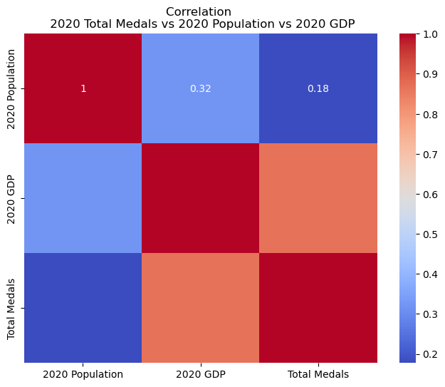

<h1> Historical Olympic Medal Analysis </h1>

## Project Overview 
This project is a comprehensive analysis of global data related to the Olympics, combining datasets on world population, GDP, and Olympic performance (medals). Through this analysis, we aim to uncover trends and correlations that could provide valuable insight for future Olympic Games. 

## Project Proposal
**Initial Scope**: Our intial scope was to answer the following questions:     
* How population affect total & gold medal?    
* What years did bigger populations do well/fall short?    
* What sports are dominated by bigger countries?     
* Which have a bigger impact population or GDP on total or gold medal counts?       

**Project Scope**: We narrowed our project down to support the data that we were able to find that matched up with the time given to meet our deadline, with presentable, relevant, data that could help the future olypics. We chose to focus on the affect host_cities, world population, and GDP has on total medal count by answering the following questions.        
* Does population have an affect on a countries total olympic medal count?
* Which as a bigger impact on total medal count GDP or World Population?
* 

## Datasets
The analysis is based on five key datasets:    
**world_population.csv**: Contains population data for each country.    
**gdp.csv**: Includes GDP figures for every country.     
**olympic_medals.csv**: Records the medal count for each country in each Olympic event.     
**olympic_analysis.csv**: Details the start and end dates of the Olympics, host country, participating   countries, and the year.      
**Olypmic_Games.csv**: Lists the country, city, and year of the Olympic Games.       

## Installation and Setup
To run this project, you need to have Python installed along with the following libraries:
* pandas
* matplotlib
* numpy
* seaborn
* sklearn

### Installation Steps:
1. Clone the repository to your local machine. 
2. Navigate to the project directory. 
3. Install the required libaries using pip:
* `pip install pandas matplotlib numpy seaborn sklearn`
4. Ensure the CSV files are placed in the `data/` directory. 

## Anlysis Techniques
This project uses the following analytical methods:

***Comparative Bar Chart*** A bar chart used to compare the medal counts of countries during the years they hosted the Olympics versus other years. 

 
***Comparative Analysis*** To identify if there is a difference in a host country's medal tally, we compared Japan's medal count from the 2020 Olympics, which Japan hosted, to its total medal tally from the previous four Olympics (2004-2016).    

 
***Economic Analysis*** Use of GDP data to gauge the affect wealthier nations have on Olympic Performance.    

 
***Time Series Analysis*** To identify trends in total medal count over time and how they correlate with various factors such as population and GDP.    

 

## Key Findings
| Title | Project ScreenShot | Key Finding |
| ----------- | ----------- | ----------- |
| Japan's Medal Performance During 2020 Olympics |  | This chart show Japan's total medal count in the 2020 Olympics, where they performed significantly better than their average in the previous four Olympic Games (2004 - 2016). Hosting the Olympics seems to have provided a noticeable boost in performance, indicating a potential "home advantage".|
| Percentage of Total Medals Won by Host Countries |  | This illustrates how host countries historically performs in terms of medal counts. It is evident that in many cases, the host countries tend to win a higher percentage of total medals, especially in earlier years. This trend flucuates and dramatically lessened in recent Olympics. |
| Correlation Between Population, GDP, and Medal Count (2020) |  | This chart provides a correlation matrix, showing the relationships between population, GDP, and total medals won in the 2020 Olympics. A strong positive correlation is observed between GDP and medal counts, indicating that wealthier countires are more likely to win more medals. The weaker correlation between populaion and medals, indicates economic resources plays a more significant role than population size. |
| GDP & Total Medal Counts |  | This chart explores a deeper relationship between GDP and Olympic success. The adata shows a clear positive trend, where countries with higher GDP's tend to win more medals. The US with the highest GDP, also tops the medal count. This reinforces that strong connection between economic power and Olympic performance. |
| GDP Growth Rate vs. Olympic Performance | | This chart examines the relationship between GDP growth rates over the decade leadig up to 2020 and the total number of medals won. The scattered nature of the data indicates the growth rate is not as strong a predictor as overall GDP. Countries with, high GDPs tend to perform better, regardless of recent economic growth. |

## Final Conclusion
The analysis shows that hosting the Olympics often gives countires a significant boost in their medal tally, as Japan's performance in 2020 indicates. However, the economic strength of a country, represented by its GDP, appears to be a more consistent and powerful predictor of Olympic success. Population size, while still relevant, plays a secondary role compared to the resources that econmomic power can provide. The flucuating advantage of host countries and the strong correlation between GDP and medals suggest that strategic investments around a countries sports infrastructure and athlete development, supported by a strong economy, are key to sustained Olympic success. 

## Future Work
Moving forward, we can explore several promising areas based on our findings. One potential direction is to ananlyze the long-term impact of hosting the Olympics on a country's sports infrastructure and athlete development, to help understand if the benefits of hosting the Olympics extends beyond medal counts.     
Additionally, we could dive deeper into the role of economic factors, such as government spending on sports, to see how it influences Olympic performance across different countries. This could provide valuable guidance for countries looking to enhance their future Olympic performance.
# Licensing & Usage
The project falls under the CC0 1.0 UNIVERSAL, no rights reserved. Feel free to use, modify, distribute, or build upon the work for any purpose, without asking permission or providing attribution to us as creators ⭐️
## References   

### Datasets
[GDP]    
[Olympic Analysis](https://www.kaggle.com/datasets/muhammadehsan000/olympic-historical-dataset-1896-2020)    
[Olympic Host](https://www.kaggle.com/datasets/muhammadehsan000/olympic-historical-dataset-1896-2020)     
[Olympic Medals](https://www.kaggle.com/datasets/muhammadehsan000/olympic-historical-dataset-1896-2020)    
[Olympic Games](https://www.kaggle.com/datasets/muhammadehsan000/olympic-historical-dataset-1896-2020)   
[World Population](https://www.kaggle.com/datasets/iamsouravbanerjee/world-population-dataset)  
### Resources
[Xpert Learning Assistant] - Assisted in debugging and cleaning code.    
[BCS Slack Tutor] - Organization and Planning 

